<p align="center">
  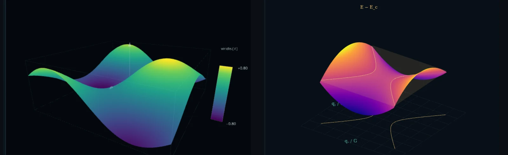
</p>

<h1 align="center">Edena</h1>

<p align="center">
  <b>Programmable mathematical visualization, scientific animation, and GPU-resident simulation — on WebGPU.</b>
</p>

<p align="center">
  <a href="#quick-start"></a>
  
  
  
</p>

Edena is a small TypeScript library for turning mathematics into pictures. Geometry stays reusable,
simulation state can live entirely on the GPU, and the same primitives power a polished explainer and a
high-throughput experiment. The visual language is borrowed from mathematical animation — dark stages,
restrained typography, bright semantic colours, and motion that explains an idea rather than decorating
it.

It is **dependency-free at runtime** (TypeScript and `@webgpu/types` are dev-only), **renderer-agnostic
where it counts** (the CPU particle seam does not mention a device), and it ships a working gallery:
every image and simulation below is a page in this repository.

---

## Gallery

<table>
  <tr>
    <td width="50%" align="center">
      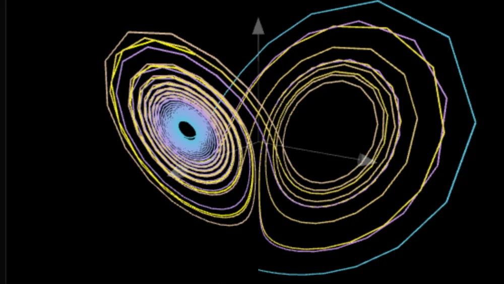<br>
      <sub><b>The Lorenz attractor</b> — 8,000 RK4 steps drawn as one polyline. <a href="physics-lab.html">Physics lab</a>.</sub>
    </td>
    <td width="50%" align="center">
      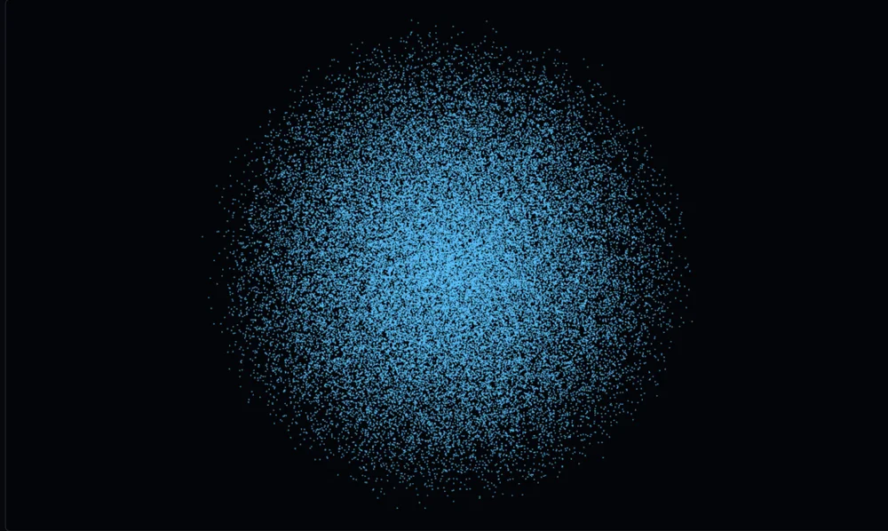<br>
      <sub><b>50,000 particles</b> — state lives in ping-pong storage buffers; the render pass instances straight out of them. <a href="particles.html">GPU particles</a>.</sub>
    </td>
  </tr>
  <tr>
    <td width="50%" align="center">
      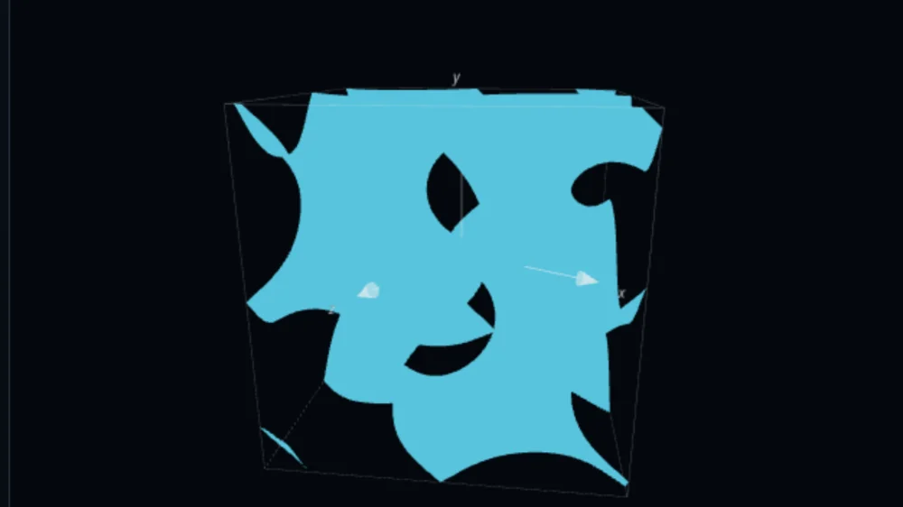<br>
      <sub><b>A gyroid</b> — <code>isosurface(f, bounds, level, resolution)</code>, CPU marching tetrahedra. <a href="index.html">Landing showcase</a>.</sub>
    </td>
    <td width="50%" align="center">
      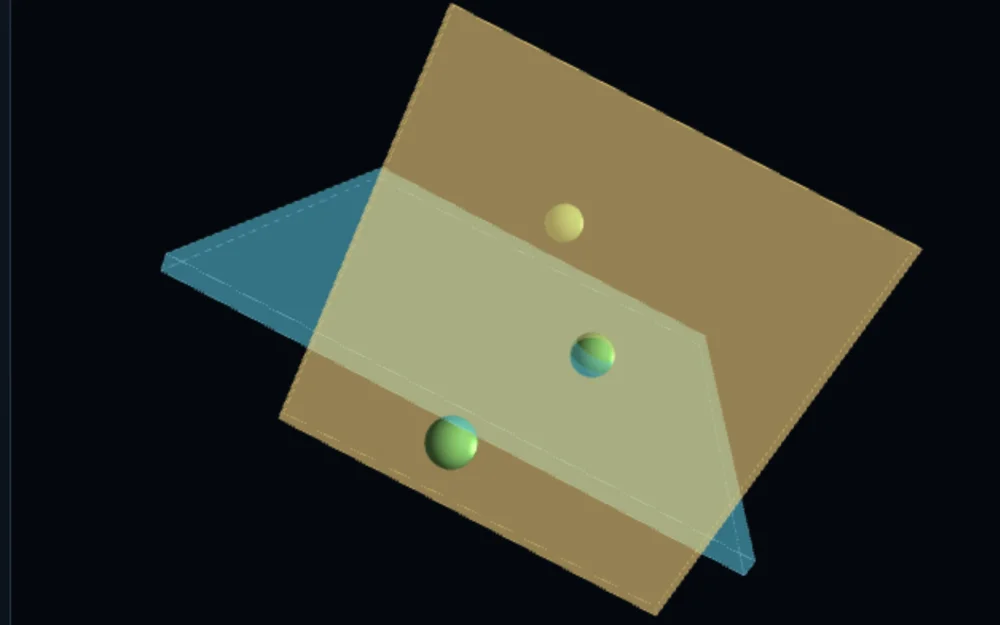<br>
      <sub><b>Depth and transparency</b> — opaque geometry writes depth, translucent faces sort back to front. <a href="basics.html">Basics 03</a>.</sub>
    </td>
  </tr>
  <tr>
    <td width="50%" align="center">
      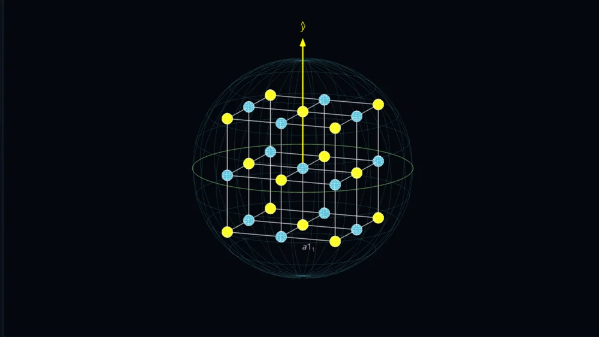<br>
      <sub><b>One mesh, many copies</b> — a cubic lattice of atoms, bonds and projected labels. <a href="index.html">Showcase</a>.</sub>
    </td>
    <td width="50%" align="center">
      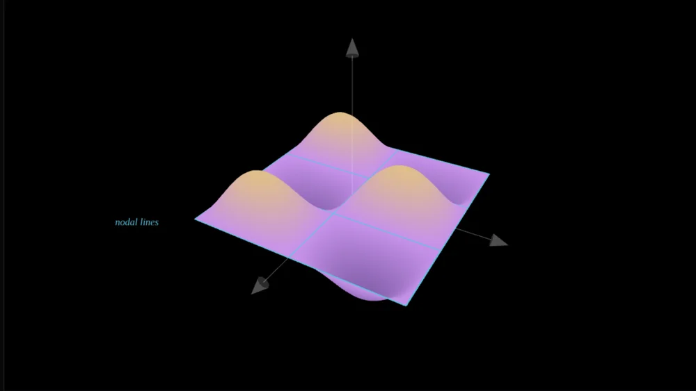<br>
      <sub><b>Vibrating drumhead</b> — one of six experiments in the <a href="physics-lab.html">physics lab</a>.</sub>
    </td>
  </tr>
  <tr>
    <td width="50%" align="center">
      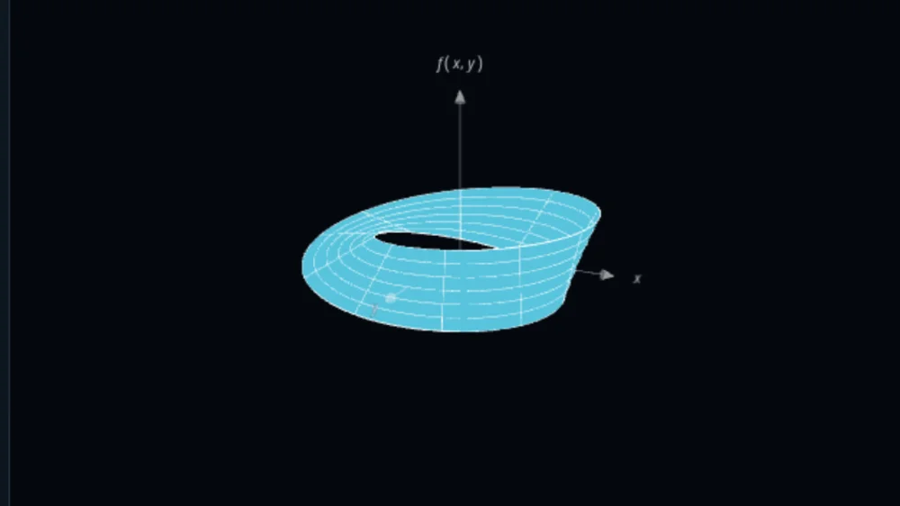<br>
      <sub><b>A Möbius strip</b> — <code>parametricSurface(u, v)</code>: one half-twist joins two ends into one side. <a href="index.html">Showcase</a>.</sub>
    </td>
    <td width="50%" align="center">
      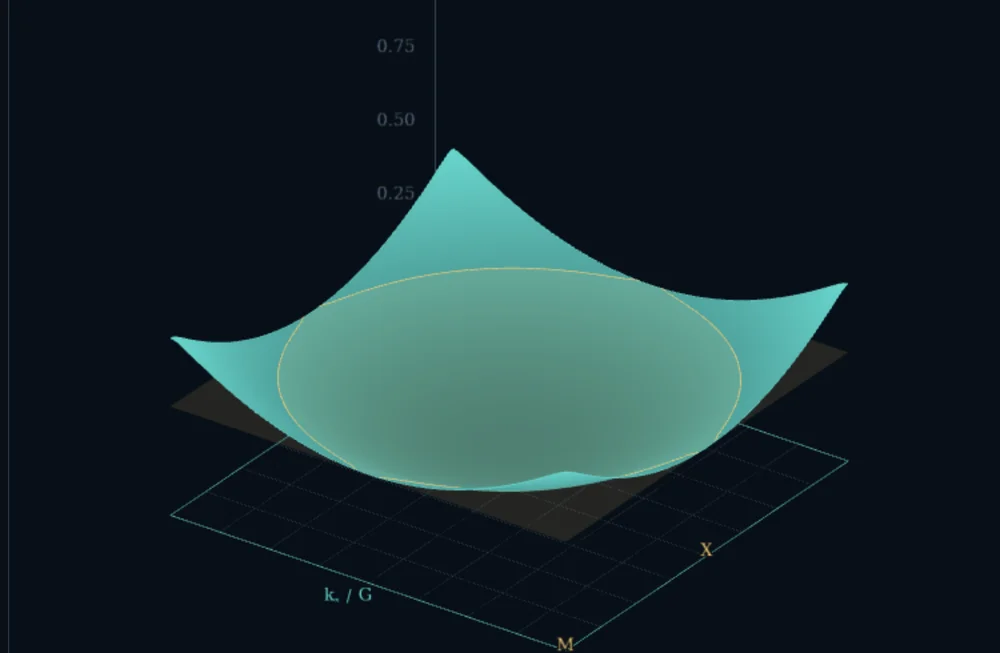<br>
      <sub><b>Bloch bands</b> — a weak potential opens a gap and reconnects a contour at a saddle. <a href="homework.html">Homework</a>.</sub>
    </td>
  </tr>
  <tr>
    <td width="50%" align="center">
      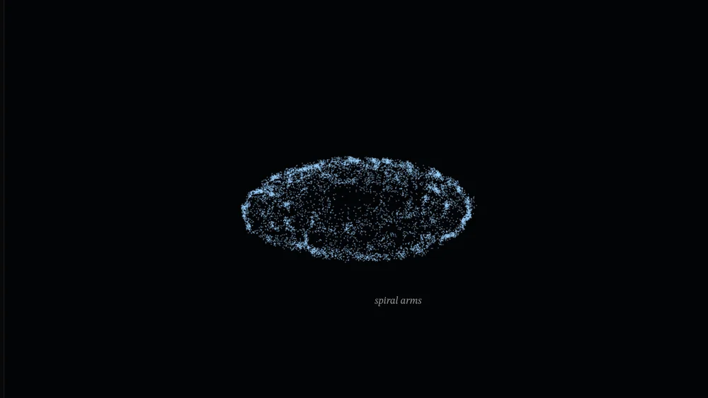<br>
      <sub><b>All-pairs gravity</b> — raw <code>O(N²)</code> on the GPU: no tree, no grid, no atomics. <a href="physics-lab.html">Physics lab</a>.</sub>
    </td>
    <td width="50%" align="center">
      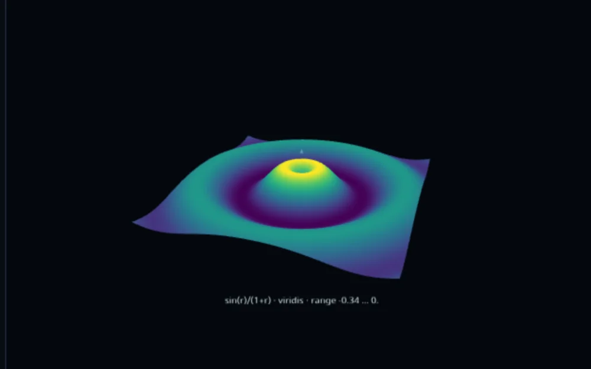<br>
      <sub><b>Colour is data</b> — <code>colorMappedSurface</code> with a stated, clampable range. <a href="basics.html">Basics 24</a>.</sub>
    </td>
  </tr>
  <tr>
    <td width="50%" align="center">
      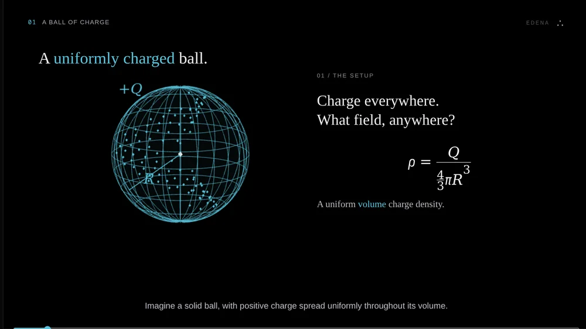<br>
      <sub><b>Electric field of a charged ball</b> — a full animatic: the volume integral, then a Gauss-law check. <a href="electrostatics.html">Electrostatics</a>.</sub>
    </td>
    <td width="50%" align="center">
      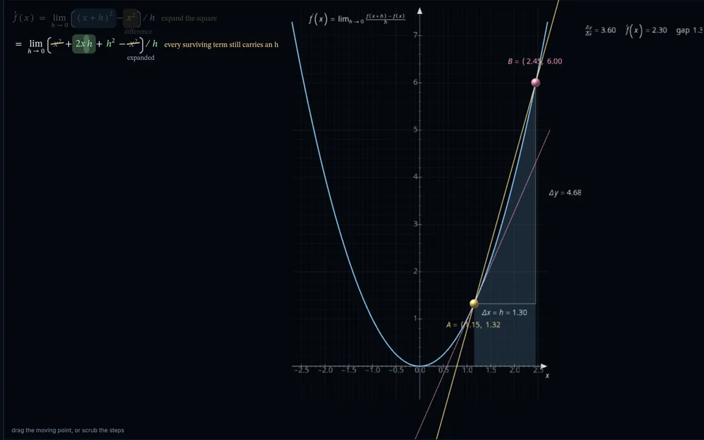<br>
      <sub><b>Typeset derivations</b> — brackets that grow, terms struck through, MathML that stays addressable. <a href="basics.html">Basics 25</a>.</sub>
    </td>
  </tr>
</table>

---

## Quick start

```sh
npm install
npm run dev        # build, then serve the gallery on http://localhost:5173
```

```ts
import { WebGPUView, Visual, functionCurve, plotFrame, rgba } from 'edena-web';

const view = await WebGPUView.create(canvas);
view.camera.yaw = 0;
view.camera.pitch = 0;

const chart = plotFrame([-4, 4], [-1.6, 1.6], { xTicks: 8, yTicks: 4 });
view.world.add(
  new Visual(chart.grid, rgba('#eeeeee', .14)),
  new Visual(chart.ticks, rgba('#eeeeee', .45)),
  new Visual(chart.axes, rgba('#eeeeee', .8)),
  new Visual(functionCurve(Math.sin, [-4, 4], 640, .018), rgba('#ffff00')),
);

(function frame() { view.render(); requestAnimationFrame(frame); })();
```

A view owns a device, a camera and a `World`. Add `Visual`s, mutate their transforms directly, and call
`view.render()` each frame — unchanged scenes are not resubmitted. Several views can share one device
and reuse its pipelines: `WebGPUView.create(otherCanvas, { device: view.device })`.

> Tested on Chrome Beta (Vulkan, AMD RX 6700 XT) and Firefox Nightly. WebGPU rendering needs a browser
> with **hardware acceleration enabled** — in Firefox, `layers.acceleration.disabled = true` renders
> WebGPU canvases blank.

---

## The showcase

Ten pages, each one a different way of using the same library:

| Page | What it is |
| --- | --- |
| **[Landing showcase](index.html)** | The interactive gallery: Fourier harmonic synthesis, value-coloured standing waves, Möbius strips, gyroid and two-ball isosurfaces, an orthographic/perspective camera, and a reversible cubic-lattice construction. |
| **[Basics](basics.html)** | The place to start. Twenty-five small demos, one library idea each, every panel naming the API it demonstrates. |
| **[Academy](academy.html)** | Twenty-two chapters that follow the mathematics into the implementation — each with a live lab, a measured claim, and a [companion chapter](docs/academy/README.md). |
| **[Physics lab](physics-lab.html)** | Kepler orbits, direct all-pairs GPU gravity, double pendulums, the Lorenz attractor, two-source wave interference, and a vibrating drumhead. |
| **[Crystal symmetry](symmetry.html)** | Drop in a POSCAR and a phonopy `symmetry.yaml`; watch rotations, mirrors, inversions and roto-reflections play on the structure. |
| **[Bloch bands](homework.html)** | A weak periodic potential, folded into a square Brillouin zone: bands, the X-point gap, Fermi-surface topology, the density of states and its van Hove logarithmic divergence. |
| **[GPU particles](particles.html)** | The 50K oscillator baseline beside direct `O(N²)` GPU gravity. |
| **[Electric field](electrostatics.html)** | A complete animatic deriving the field of a uniformly charged ball, including the volume integral and a Gauss-law check. |
| **[3D field](field.html)** | The smallest possible implicit-surface example. |
| **[Legacy](legacy.html)** | The archived first prototype, kept honest and retired. |

---

## The library

Everything is re-exported from `edena-web` (`src/index.ts`).

| Area | Main tools |
| --- | --- |
| **Geometry** | `polyline`, `arrow`, `circle`, `sphere`, `shadedSphere`, `wireSphere`, `box`/`boxEdges`, `cylinder` (frustum, cone), `parametricSurface`, `functionCurve`, `functionSurface`, `merge` — closed solids wound outward, so a signed volume is positive |
| **Plotting** | `plotFrame` (major and minor ticks, gridlines, axis titles, anchors carrying plain text *and* MathML), `areaUnder`, `lineThrough`, `secantSlope`, `axes3d`, `boundsBox`, `niceStep`, `tickValues`, `tickMath`, `formatTick` |
| **Fields & vectors** | `isosurface` (marching tetrahedra), `streamlines` (RK4), `sphereSeeds` |
| **Colour** | `ramp`, `viridis`, `plasma`, `colorMappedSurface` |
| **Scene graph** | `Visual`, `Group`, `World` — visibility, opacity, `remove(...nodes)`, transforms (`position`, `scale`, `rotation`, optional Euler `orientation`), `reveal`, and `orientationMatrix`/`applyMatrix` for the same maths outside the graph |
| **Camera & view** | Orbit controls, orthographic or perspective projection, MSAA, alpha mode, DPR cap, projected `LabelLayer` text, and `onResize` so a demo can re-fit its camera |
| **Animation** | Absolute-time `Timeline` and `tween` |
| **Simulation** | `createParticleState`/`stepParticles`/`ParticleSimulation` (CPU, renderer-agnostic) and `GpuParticleSimulation` (ping-pong storage buffers, compute integration, instanced rendering, timestamps, reset, checksums) |
| **Crystal** | `parsePOSCAR`, `parsePhonopySymmetry`, `cellFromParameters`, `supercell`, `bonds`, `nearestNeighbours`, `latticePointGroup`, `mapsOntoSelf`, `siteMapping`, `symmetryOrbits`, `operationIsometry`/`isometryPoint`/`isometryTarget` |
| **Elements** | `ELEMENTS`, `appearanceFor` (CPK-brightened colours and covalent radii) |
| **Math text** | `mathml`/`mi`/`mn`/`mo`/`frac`/`sqrt`/`msub`/`msup`/`matrix`/`cases`/`vec`/`integral`/`summation`… plus `number` (real minus signs, grouped digits) and `latex('\\frac{a}{b}')` → native MathML |
| **Derivations** | `Derivation` — addressable tokens and *beats*: brackets that grow, terms struck through, colour changes and notes, playable or scrubbable |
| **Pointer picking** | `OrbitCamera.ray`, `rayPlane`, `rayDistance`, `screenDistance`, and `attachHandles`, a drag layer that locks the camera while a handle is held |

<details>
<summary><b>The twenty-five ideas in the basics tour</b></summary>

Each panel is a self-contained factory in [`src/examples/basics.ts`](src/examples/basics.ts) that builds
its own world and returns its own `update`, while the page gives them one device and one render loop.

| # | Idea | What it shows |
| --- | --- | --- |
| 01 | The frame | `axes3d`, `boundsBox`, ticks, a grid, projected labels, orthographic or perspective |
| 02 | Motion | one `Timeline`, three easings, absolute-time seeking |
| 03 | Volume | `box`/`sphere`/`cylinder` faces, per-face alpha, wire outlines, draw-order independence |
| 04 | Shape | the primitive set, ending in a `parametricSurface` and a 3D tumble |
| 05 | Hierarchy | `Group.add`, inherited transforms, opacity that multiplies down the tree |
| 06 | Text | `LabelLayer.addHTML` with MathML, sharp and selectable at any zoom |
| 07 | Colour | per-vertex colour built into a `Geometry`, with `viridis`/`plasma`/`ramp` |
| 08 | Plotting | `plotFrame`, a `functionCurve`, and equation labels |
| 09 | Depth | opaque first, then translucent faces sorted back to front |
| 10 | Sharing | one `Geometry` scaled across hundreds of nodes, bucketed into one draw per geometry and colour |
| 11 | Camera | `yaw`, `pitch` and `distance` driven as a shot and scrubbed like a storyboard |
| 12 | Simulation | the CPU seam: `createParticleState`/`stepParticles` with an acceleration you write |
| 13 | Implicit surfaces | `isosurface` extracting `f(x, y, z) = level` inside a `boundsBox` |
| 14 | Vector fields | `streamlines` integrated with RK4 from `sphereSeeds`, with markers riding them |
| 15 | Story | four cues on one `Timeline`, group opacity and per-visual `reveal` |
| 16 | Diagram | `arrow` plus construction lines, named with the `vec` accent, restated in a readout |
| 17 | Path | a cubic Bézier sampled into a tube, with raw and eased parameters both printed |
| 18 | Normals | a height field sampled on a grid, normals drawn as a comb of arrows |
| 19 | Layers | three groups switched with `visible` |
| 20 | Chart | data scaled into one bar mesh, an axis from `tickValues`/`niceStep`, an eased sort |
| 21 | Follow | `camera.target` animated under a marker while the scene stands still |
| 22 | Transform | a node's own matrix read back and typeset as its scale, yaw and tilt change |
| 23 | Measure | a dimension line, its legs, an angle arc and three live labels |
| 24 | Colour map | `colorMappedSurface` sampling a field once, with a stated, clampable range |
| 25 | Derivation | `Derivation`: growing brackets, cancellations, colour changes, beat by beat, beside a plot that follows the algebra |

</details>

### Plotting, fields, particles

```ts
import { plotFrame, isosurface, colorMappedSurface, viridis, GpuParticleSimulation } from 'edena-web';

const frame = plotFrame([-3, 3], [-1, 1], { grid: true });
const surface = colorMappedSurface((x, y) => Math.sin(x) * Math.cos(y), [-3, 3], [-3, 3], viridis, [48, 48]);
const blob = isosurface((x, y, z) => 0.6 - Math.hypot(x, y, z), { min: [-1, -1, -1], max: [1, 1, 1] }, 0, 48);

const sim = await GpuParticleSimulation.create({ count: 50_000, mode: 'oscillator' });
```

`mode: 'nbody'` runs direct all-pairs gravity with softening and an optional disc layout — a raw
`O(N²)` reference path, capped at 32,768 bodies. The oscillator mode reaches 50,000 particles in the
benchmark page.

### Dragging and picking on the canvas

```ts
import { attachHandles } from 'edena-web';

const detach = attachHandles(canvas, view.camera, () => [
  { at: () => marker, radius: 30, plane: { normal: [0, 1, 0] }, cursor: 'grab', to: point => { marker = point; } },
]);
```

`at()` is read every frame, so a handle can ride a moving scene. `plane: 'view'` slides a handle in the
plane facing the reader; an explicit normal pins it, e.g. to a floor. Grabbing a handle sets
`camera.locked`, so orbiting and dragging never fight over the same gesture.

### Crystal workflow

The symmetry viewer accepts extensionless POSCAR files, VASP 4 and 5 layouts, positive or
target-volume scale factors, Direct or Cartesian positions, Selective Dynamics lines, and phonopy
symmetry files in nested, row-oriented or flat ten-number rotation formats. Files are parsed locally in
the browser: drop them anywhere on the page, or pick them from the card.

```ts
import { parsePOSCAR, parsePhonopySymmetry, operationIsometry, isometryPoint } from 'edena-web';

const structure = parsePOSCAR(await poscarFile.text());
const operations = parsePhonopySymmetry(await symmetryFile.text());

const isometry = operationIsometry(structure.lattice, operations[0]);
const halfway = isometryPoint(isometry, structure.positions[0], 0.5);   // identity at t = 0, the full map at t = 1
```

Tolerances are relative to the crystal, not to absolute units, so a POSCAR rounded to four decimals
keeps the symmetry it has while a genuinely sheared cell is still rejected. Improper operations are
reported and animated as the rotoreflection they are, `S(θ, n) = R(θ, n)·σ_n`: the whole rotation, then
the whole fold.

---

## Rendering behaviour

- **Opaque geometry writes depth**, so front surfaces occlude rear surfaces regardless of submission
  order. Transparent objects render afterward, test against solid depth, and blend back-to-front by
  projected origin; intersecting transparent meshes still need a more advanced technique, so use
  opaque materials for solid scientific plots.
- **Unchanged scenes submit no GPU work.** Camera, transform, material, text and visibility changes
  trigger a redraw automatically; `view.render(true)` forces one.
- **Instance data stays on the GPU.** Static batches need no repeat uploads, camera motion updates only
  uniforms, and sparse transform changes upload only the changed interval. Mutating a node's `position`,
  `scale` or `orientation` array works — no dirty flag.
- **Labels are depth-tested glyph textures.** Scene text is laid out by the browser, cached at the
  view's pixel ratio, and drawn through the same depth buffer as geometry, so a solid can cover part of
  a word; its DOM copy stays available to accessibility tools. Use `occlude: false` for a deliberate
  overlay caption.
- The renderer is intentionally **unlit** at this stage. Colour ramps, geometry, camera motion,
  antialiasing and depth-tested labels carry the visual language.

---

## Performance

Measurements on Chrome Beta with Vulkan and an AMD RX 6700 XT. They are guidance, not guarantees; see
[the performance report](docs/performance.md) for reproducible CPU, rendering and text benchmarks.

| Workload | Result |
| --- | --- |
| Landing showcase | 60 FPS, four views, ~123K triangles |
| Crystal symmetry viewer | Painted in ~0.2 s; 60 FPS from 1×1×1 to a 1,600-atom cell; a 400-atom POSCAR loads in ~0.5 s and a 1,600-atom one in ~1.1 s |
| Physics laboratory | 60 FPS, six views, ~54K triangles |
| GPU oscillator | 50,000 particles, ~0.022 ms GPU integration per step |
| GPU direct n-body | 8,192 bodies ≈ 0.25 ms/step; 32,768 ≈ 3.1 ms/step |
| Isosurface extraction | 250,000-sample budget; 48³ two-ball field ≈ 110 ms CPU |

Default budgets throw when exceeded: isosurfaces allow 250,000 grid samples, surfaces 250,000 quads,
curves 100,000 samples, and polylines 100,000 points. CPU field extraction blocks the frame that
requests it, so precompute or lower resolution for interactive controls.

---

## Development

```sh
npm install
npm run typecheck   # tsc -p tsconfig.library.json --noEmit
npm test            # build, then node --test tests/*.test.mjs
npm run build       # compile the library, showcase and demos into build/
npm run dev         # build, then serve the gallery on http://localhost:5173
```

The browser checks need Chrome on a debugging port and the dev server (`node scripts/serve.mjs`):

```sh
node scripts/check-links.mjs             # every page's links, scripts and route to the tour — no browser
node scripts/check-pages.mjs [port]      # every page loads, draws every canvas, and stays quiet
node scripts/check-basics.mjs [port]     # the basics tour: twenty-five demos, every control, every assertion
node scripts/check-academy.mjs [port]    # twenty-two chapters, every control, the simulation
node scripts/check-depth.mjs [port]      # renderer depth and the crystal viewer, pixel by pixel
node scripts/check-renderer.mjs [port]   # buffer reuse, idle frames, sparse uploads, labels, resize
node scripts/check-text-depth.mjs [port] # partial text occlusion, MathML, styling, texture reuse
node scripts/check-transparency.mjs [port] # alpha ordering, instancing and wireframe separation
node scripts/check-particles.mjs [port]  # GPU results against a CPU force reference
node scripts/benchmark.mjs [port]        # rendering, text and GPU medians
```

`check-basics` captures from the compositor and measures the regions back inside the page, because a
WebGPU canvas cannot be read once it has been presented. It asserts that each demo draws something
distinct, that each control moves its own stage and no other, that each spin button holds the picture
still and starts it again, that the helix, the timeline and the simulation advance, and that nothing
logs an error. Disconnecting any single control makes it fail.

---

## Roadmap

The project is early and intentionally focused. PDE solvers, spatial interaction structures, lighting
and material systems, richer text layout, SVG import and broader Manim feature coverage remain future
work — see [VISUALIZATION_LIBRARY_PLAN.md](VISUALIZATION_LIBRARY_PLAN.md).

## License

ISC.
